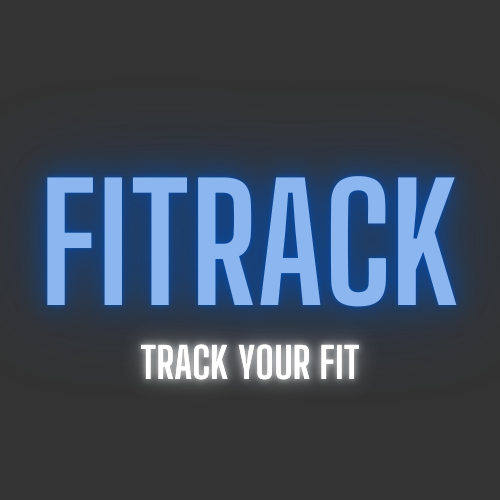

<!-- Improved compatibility of back to top link: See: https://github.com/othneildrew/Best-README-Template/pull/73 -->
<a id="readme-top"></a>
<!--
*** Thanks for checking out the Best-README-Template. If you have a suggestion
*** that would make this better, please fork the repo and create a pull request
*** or simply open an issue with the tag "enhancement".
*** Don't forget to give the project a star!
*** Thanks again! Now go create something AMAZING! :D
-->


<!-- PROJECT SHIELDS -->
<!--
*** I'm using markdown "reference style" links for readability.
*** Reference links are enclosed in brackets [ ] instead of parentheses ( ).
*** See the bottom of this document for the declaration of the reference variables
*** for contributors-url, forks-url, etc. This is an optional, concise syntax you may use.
*** https://www.markdownguide.org/basic-syntax/#reference-style-links
-->
[![Contributors][contributors-shield]][contributors-url]
[![Forks][forks-shield]][forks-url]
[![Stargazers][stars-shield]][stars-url]
[![Issues][issues-shield]][issues-url]
[![MIT License][license-shield]][license-url]


<!-- PROJECT LOGO -->
<br />
<div align="center">
  <a href="https://github.com/SE310-Team-1/SE310_Fitness_Tracker">
    
  </a>

<h3 align="center">FiTrack</h3>

  <p align="center">
    <div align="left">
    FiTrack is a web-app that allows users to add custom exercises and then track their gym progress over time. The app will store the users workout data locally and use this data set to display intuitive visualisations of the users progress and allow them to recap previous workouts. The goal of this system is to keep users informed and motivated regarding their efforts at the gym.
    </div>
    <br />
    <a href="https://github.com/SE310-Team-1/SE310_Fitness_Tracker"><strong>Explore the docs »</strong></a>
    <br />
    <br />
    <a href="https://github.com/SE310-Team-1/SE310_Fitness_Tracker/issues/new?labels=bug&template=bug-report---.md">Report Bug</a>
    ·
    <a href="https://github.com/SE310-Team-1/SE310_Fitness_Tracker/issues/new?labels=enhancement&template=feature-request---.md">Request Feature</a>
  </p>
</div>


<!-- TABLE OF CONTENTS -->
<details>
  <summary>Table of Contents</summary>
  <ol>
    <li>
      <a href="#About The Project">About The Project</a>
      <ul>
        <li><a href="#built-with">Built With</a></li>
      </ul>
    </li>
    <li>
      <a href="#getting-started">Getting Started</a>
      <ul>
        <li><a href="#prerequisites">Prerequisites</a></li>
        <li><a href="#installation">Installation</a></li>
      </ul>
    </li>
    <li><a href="#usage">Usage</a></li>
    <li><a href="#roadmap">Roadmap</a></li>
    <li><a href="#contributing">Contributing</a></li>
    <li><a href="#license">License</a></li>
    <li><a href="#acknowledgments">Acknowledgments</a></li>
  </ol>
</details>


<!-- About The Project -->
## About The Project

We plan to create a web-app that allows users to add custom exercises and then track their gym progress over time. The app will store the users workout data locally, display clear visualisations of the users progress, and also allow them to recap previous workouts. The goal of this system is to keep users informed and motivated regarding their efforts at the gym.

<p align="right">(<a href="#readme-top">back to top</a>)</p>


### Built With

* [![Next][Next.js]][Next-url]
* [![React][React.js]][React-url]
* [![Express][Express.js]][Express-url]
* [![SQLite][SQLite.js]][SQLite-url]
* [![Vitest][Vitest.js]][Vitest-url]

<p align="right">(<a href="#readme-top">back to top</a>)</p>


<!-- GETTING STARTED -->
## Getting Started

To get a local copy up and running follow these simple example steps.

### Prerequisites

This is an example of how to list things you need to use the software and how to install them.
* npm
  ```sh
  npm install npm@latest -g
  ```

### Installation

1. Clone the repo
   ```sh
   git clone https://github.com/SE310-Team-1/SE310_Fitness_Tracker.git
   ```
2. Navigate to the fitness_tracker folder and Install NPM packages
   ```sh
   cd ./fitness_tracker
   npm install
   ```
3. Now, navigate to the server folder and Install NPM packages
   ```sh
   cd ../server
   npm install
   ```
4. Now, in the server folder, open a new terminal and run the server 
   ```sh
   npm start
   ```
5. Finally, go back to the fitness_tracker folder, open a new terminal and run the project 
   ```sh
   cd ../fitness_tracker
   npm start
   ```
6. You can click the link on the terminal or can type http://localhost:3000/ in your own browser

<p align="right">(<a href="#readme-top">back to top</a>)</p>


<!-- USAGE EXAMPLES -->
## Usage

Use this space to show useful examples of how a project can be used. Additional screenshots, code examples and demos work well in this space. You may also link to more resources.

demo relevant screenshots might go here

<p align="right">(<a href="#readme-top">back to top</a>)</p>


<!-- ROADMAP -->
## Upcoming Features

- [ ] Track and display workout metrics
    - [ ] Graph progress over time
    - [ ] Calendar overview of days worked out
- [ ] Weight/sets/reps
- [ ] Create profile (name, profile image)
- [ ] Specify custom workouts
- [ ] Achievements
- [ ] Generate routine
- [ ] Workout Wrapped (like Spotify Wrapped)
- [ ] CLoud storage
- [ ] Export Image
- [ ] Streaks

See the [open issues](https://github.com/SE310-Team-1/SE310_Fitness_Tracker/issues) for a full list of proposed features (and known issues).

<p align="right">(<a href="#readme-top">back to top</a>)</p>


<!-- CONTRIBUTING -->
## Contributing

Contributions are what make the open source community such an amazing place to learn, inspire, and create. Any contributions you make are **greatly appreciated**.

If you have a suggestion that would make this better, please fork the repo and create a pull request. You can also simply open an issue with the tag "enhancement".
Don't forget to give the project a star! Thanks again!

1. Fork and clone the Project
2. Create your Feature Branch (`git checkout -b feature/AmazingFeature`)
3. Commit your Changes (`git commit -m 'Add some AmazingFeature'`)
4. Push to the Branch (`git push origin feature/AmazingFeature`)
5. Open a Pull Request and assign Assignees

<p align="right">(<a href="#readme-top">back to top</a>)</p>


<!-- LICENSE -->
## License
 
Distributed under the Apache-2.0 license. See `LICENSE.txt` for more information.

<p align="right">(<a href="#readme-top">back to top</a>)</p>


<!-- ACKNOWLEDGMENTS -->
## Acknowledgments

* [Best-README_Template](https://github.com/othneildrew/Best-README-Template?tab=readme-ov-file)

<p align="right">(<a href="#readme-top">back to top</a>)</p>


<!-- MARKDOWN LINKS & IMAGES -->
<!-- https://www.markdownguide.org/basic-syntax/#reference-style-links -->
[contributors-shield]: https://img.shields.io/github/contributors/SE310-Team-1/SE310_Fitness_Tracker.svg?style=for-the-badge
[contributors-url]: https://github.com/SE310-Team-1/SE310_Fitness_Tracker/graphs/contributors
[forks-shield]: https://img.shields.io/github/forks/SE310-Team-1/SE310_Fitness_Tracker.svg?style=for-the-badge
[forks-url]: https://github.com/SE310-Team-1/SE310_Fitness_Tracker/network/members
[stars-shield]: https://img.shields.io/github/stars/SE310-Team-1/SE310_Fitness_Tracker.svg?style=for-the-badge
[stars-url]: https://github.com/SE310-Team-1/SE310_Fitness_Tracker/stargazers
[issues-shield]: https://img.shields.io/github/issues/SE310-Team-1/SE310_Fitness_Tracker.svg?style=for-the-badge
[issues-url]: https://github.com/SE310-Team-1/SE310_Fitness_Tracker/issues
[license-shield]: https://img.shields.io/github/license/SE310-Team-1/SE310_Fitness_Tracker.svg?style=for-the-badge
[license-url]: https://github.com/SE310-Team-1/SE310_Fitness_Tracker/blob/master/LICENSE.txt
[linkedin-shield]: https://img.shields.io/badge/-LinkedIn-black.svg?style=for-the-badge&logo=linkedin&colorB=555
[product-screenshot]: images/screenshot.png
[Next.js]: https://img.shields.io/badge/next.js-000000?style=for-the-badge&logo=nextdotjs&logoColor=white
[Next-url]: https://nextjs.org/
[React.js]: https://img.shields.io/badge/React-20232A?style=for-the-badge&logo=react&logoColor=61DAFB
[React-url]: https://reactjs.org/
[Express.js]: https://img.shields.io/badge/Express.js-000000?logo=express&logoColor=fff&style=flat
[Express-url]: https://expressjs.com/
[SQLite.js]: https://img.shields.io/badge/SQLite-07405E?style=flat&compact=true&logo=sqlite&logoColor=white
[SQLite-url]: https://www.sqlite.org/
[Vitest.js]: https://img.shields.io/badge/vitest-6E9F18?style=for-the-badge&logo=vitest&logoColor=white
[Vitest-url]: https://vitest.dev/
